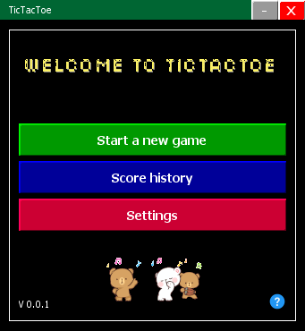
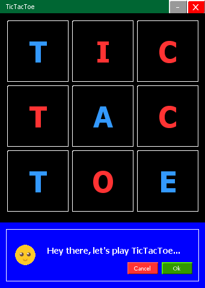

# TicTacToe-MiniMax-Java

This is a simple Tic-Tac-Toe game that utilizes the Mini-Max Algorithm to make decisions.

## Features

- Play Tic-Tac-Toe against a challenging AI opponent.
- Powered by the Mini-Max algorithm for strategic gameplay.
- Compatibility tested on Windows.

## How to Run

1. Clone the repository to your local machine.
2. Open the project in your preferred Java IDE (e.g., NetBeans IDE 8.2).
3. Run the game and start playing!

Enjoy a classic game of Tic-Tac-Toe with a twist! Challenge yourself against the AI and strategize your way to victory.
